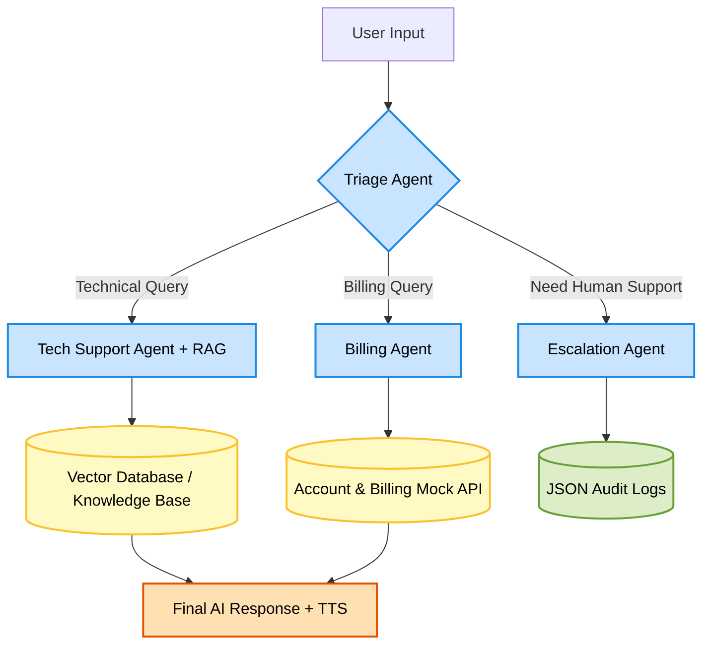

# AI Customer Support Multi-Agent Architecture

---

## Flow Explanation

1. User sends a query.
2. Triage Agent identifies the query type.
3. Based on intent:
   - Technical issues → Tech Agent + RAG
   - Billing issues → Billing Agent
   - Human support needed → Escalation Agent
4. Tech Agent retrieves context from the Knowledge Base.
5. Billing Agent interacts with Account/Billing API.
6. Final response is generated with optional Text-to-Speech (TTS).
7. Escalated requests are stored in JSON audit logs.

---

## Components Used

| Component | Purpose |
|---|---|
| Triage Agent | Routes user requests |
| Tech Agent | Handles technical questions |
| RAG Pipeline | Retrieves contextual knowledge |
| Billing Agent | Handles billing/account queries |
| Escalation Agent | Transfers complex cases to humans |
| Vector DB | Stores embeddings and documents |
| Mock API | Simulates billing/account system |
| JSON Logs | Stores escalated conversations |
| TTS | Converts response to voice |

---

## Tech Stack Suggestion

- Python
- FastAPI
- LangChain / LlamaIndex
- OpenAI / Gemini APIs
- ChromaDB / FAISS
- ElevenLabs / gTTS
- Streamlit or React Frontend